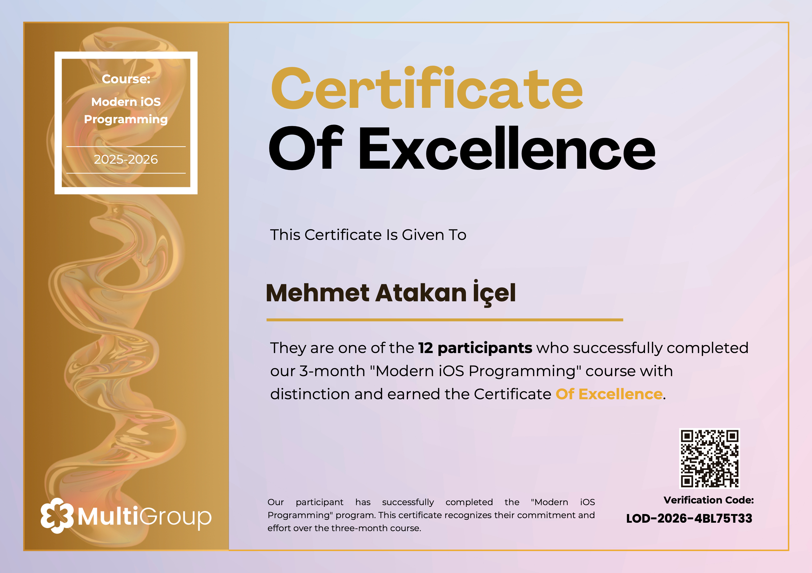

# Modern SwiftUI Bootcamp Reposu

### 🏆 Certificate of Excellence
MutliAcademy ve Developer MultiGroup ekibi tarafından düzenlenen "Modern iOS Programming Course with Certification" eğitimini başarıyla tamamlayan **12 seçkin katılımcıdan biri** olarak bu sertifikayı almaya hak kazandım.

**Doğrulama Kodu:** `LOD-2026-4BL75T33`

 

---

İlk 3 ödev için ayrı bir uygulama oluşturup ödevleri bir arada tuttum. Diğer ödevler için ayrı ayrı projeler oluşturulmuştur.

## Ödevler

[Ödev 1](Bootcamp/Homework1.swift)
    - Swift dilinin temellerini (Değişkenler, Optionals) pekiştiren, basit bir hesap makinesi ve dizi filtreleme mantığı içeren giriş seviyesi bir çalışmadır.

[Ödev 2](Bootcamp/Homework2.swift)
    - SwiftUI'ın temel yapı taşları olan View, Text, Image, Button gibi bileşenleri kullanarak statik ekranlar tasarlama ve bu bileşenleri düzenlemek için HStack, VStack, ZStack gibi layout araçlarını kullanma becerilerini geliştirmeye odaklanmıştır.

[Ödev 3](Bootcamp/Homework3.swift)
    - SwiftUI'da kullanıcı etkileşimini yönetmek ve arayüzün dinamik olarak tepki vermesini sağlamak için kullanılan temel mekanizma olan State yönetimini pratik uygulamalar üzerinden öğretmeyi amaçlamaktadır.

[Ödev 4 - MasterListApp](MasterListApp)
    - SwiftUI'da liste (List) ve navigasyon (NavigationStack) yapılarını kullanarak veri listeleme ve detay sayfalarına geçiş gibi temel kullanıcı akışlarını oluşturmayı amaçlamaktadır.

[Ödev 5 - TaskApp](TaskApp)
    - MVVM mimarisi kullanılarak oluşturulmuş, görevlerin durumuna göre (Bekleyen/Tamamlanan) bölümlere ayrıldığı, temiz bir arayüze sahip görev takip uygulamasıdır.

[Ödev 6 - UserFlowApp](UserFlowAPP)
    - Kullanıcıların uygulamaya giriş yapma (Login), hesap oluşturma (Register) ve şifre sıfırlama gibi temel kimlik doğrulama süreçlerini deneyimleyebilecekleri, modern tasarıma sahip bir akış uygulamasıdır.

[Ödev 7 - Not Defteri Uygulaması](Notebook)
    - Not ekleme, düzenleme ve silme işlemlerinin yapılabildiği, boş durum (empty state) yönetimi içeren, yerel veri yönetimi (NoteManager) ile çalışan bir not uygulamasıdır.

[Ödev 8 - Not Defteri (CRUD)(CoreData)](NotDefteri)
    - Core Data framework'ünü kullanarak kalıcı veri depolama (Persistence) kavramlarını pratik olarak öğrenmeyi amaçlayan, notların veritabanında saklanmasını ve yönetilmesini sağlayan bir uygulamadır.

[Ödev 9 - API'den Veri Çekmek(URLSession & JSON DECODE)](APIGETAPP)
    - URLSession kullanarak harici bir API'den (JSONPlaceholder) veri çekme, bu veriyi Swift modellerine dönüştürme (JSON Decode) ve sonuçları SwiftUI arayüzünde görüntüleme becerilerini geliştirmeye odaklanmıştır.

[Ödev 10 - API Explorer](APIExplorer)
    - Sayfalama (pagination/infinite scroll), gecikmeli arama (debounce) ve favorilere ekleme gibi ileri seviye özellikler barındıran, Rick and Morty API benzeri bir yapıdan karakterleri listeleyen gelişmiş bir keşif uygulamasıdır.

[Ödev 11 - MapApp](MapApp)
    - MapKit ve CoreLocation kullanılarak anlık konum takibi yapan, adres çözümleme (geocoding) ile konumları isimlendirip SwiftData/CoreData ile favorilere kaydedebilen harita uygulamasıdır.

[Ödev 12 - WidgetDeneme](https://github.com/MAtakanicel/widgetDeneme.git)
    